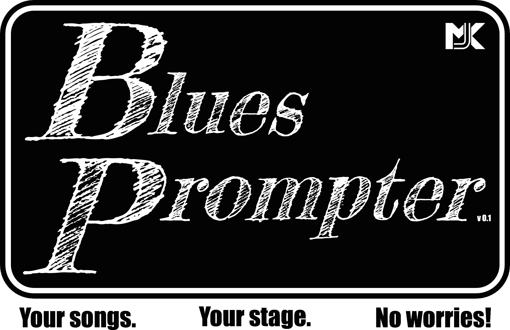

**BluesPrompter** is a stage teleprompter app specifically for gigging musicians. No need to worry about forgetting chords or lyrics, no messing around with music stands, sheaves of paper or tablet mounts - it's all there on the screen in front of you.

Currently the app is written to run as a local web app, but it is my plan to convert it to a cross-platform app once the initial development phase is complete. Data is stored locally in JSON files and the whole app runs on the local machine - no risk of things falling apart mid-concert because of a dodgy internet connection

Please note that it was developed for personal use based on my requirements, so will probably not have functionality that others need or expect. Also I run it locally in a dev environment, so you will need to know how to set this up to be able to use it.

## Running the app

The app was run developed using Node 18.18.2. It uses React 18.2. To run the app enter the following command in the terminal:

```
    $ npm run dev
```

The app runs in the browser at [`localhost:5173`](url:'localhost:5173')

I run the app on a Raspbery Pi with an external 4k screen. Navigation works using keypresses as detailed below. I use an Arduino as a keyboard emulator attached to footpedals to allow hands-free operation on stage.

## Customisation

As I said, this was written for personal use and the formating is optimised for the screen I used. You may need to change the settings to optimise it on your screen. Formatting is mainly done inline using [_tailwindcss_](url:'https://tailwindcss.com/docs/installation').

## Navigation

Navigation options are shown on the screen. In my setup I have a footswitch controlled by an [ arduino ](url:'https://github.com/mjkeeble/openSongPrompt/blob/main/footswitch/footswitch.ino') with three momentary switches that can be pressed or pressed and held. For keyboard navigation these are mapped as follows:
- left footswitch: short press - 'u', long press - 'j'
- centre footswitch: short press - 'i', long press - 'k'
- right footswitch: short press - 'o', long press - 'l'

## Data storage

Data is stored in JSON files in the `data` folder. There is one file for gigs, and another for songs. See the types.ts file for schema details. The gigs JSON is of type `TGig[]`, songs is of type `TSong[]`.

## Roadmap

The following future improvements are envisaged:

1. Add JSON-server as backend emulator (in progress)
2. Add tests
1. Add chord diagram display option
1. Add theatre mode for text only
1. Add song/gig imports (e.g.from USB)
1. Creation of a auth-protected supporting back-end service to store gig and song information with an appropriate front-end interface to manage records
1. Add setlist creator to backend service
1. Add band-member configuration for multiple displays.
1. Network displays for coordination (maybe?)
1. Create a cross-platform app version alongside the web app to allow it to run on a tablet or smartphone (consider Electron or React Native)
1. Add an opening splash page when initially loading, include key contributors
1. Upload and display user's logo
1. Add pdf display option?

## Contributing to this project

Thank you for considering contributing to this project. I hope that together we can turn this into a fantastic tool for performers everywhere.
Please see the contribution guidelines ['here'](./CONTRIBUTING.md)
